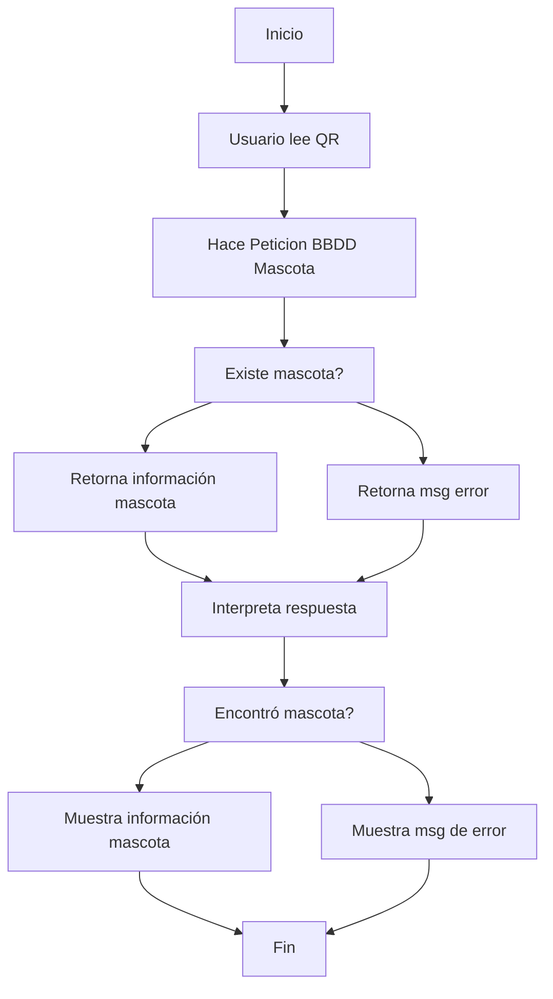

# TrabajosU

# TrabajosU
## Trabajo de Estructura de datos II

### Historia de Usuario

### Diagrama de flujo Markdown

### Diagrama de casos de uso
{width='100px'}

### Pseudocódigo
<b>CA1:</b> Generar código QR que conecte a la base de datos.
    1. Seleccionar la mascota de la que se desea generar el código QR.
    2. Obtener el ID de la mascota.
    3. Generar el código QR con el ID de la mascota.
    4. Guardar el código QR en la base de datos junto con la información de la mascota asociada.

<b>CA2:</b> El código QR debe tener el ID de la mascota de la cual realizará la consulta.
    1. Al generar el código QR en el CA1, se incluirá el ID de la mascota en el código.

<b>CA3:</b> Al leer el código QR, se guardará la información de la mascota en un JSON.
    1. Leer el código QR escaneado por el usuario.
    2. Obtener el ID de la mascota asociada al código QR.
    3. Buscar la información de la mascota en la base de datos utilizando el ID obtenido en el paso anterior.
    4. Crear un objeto JSON con la información de la mascota obtenida.
    5. Guardar el objeto JSON para su uso posterior en el sistema.
